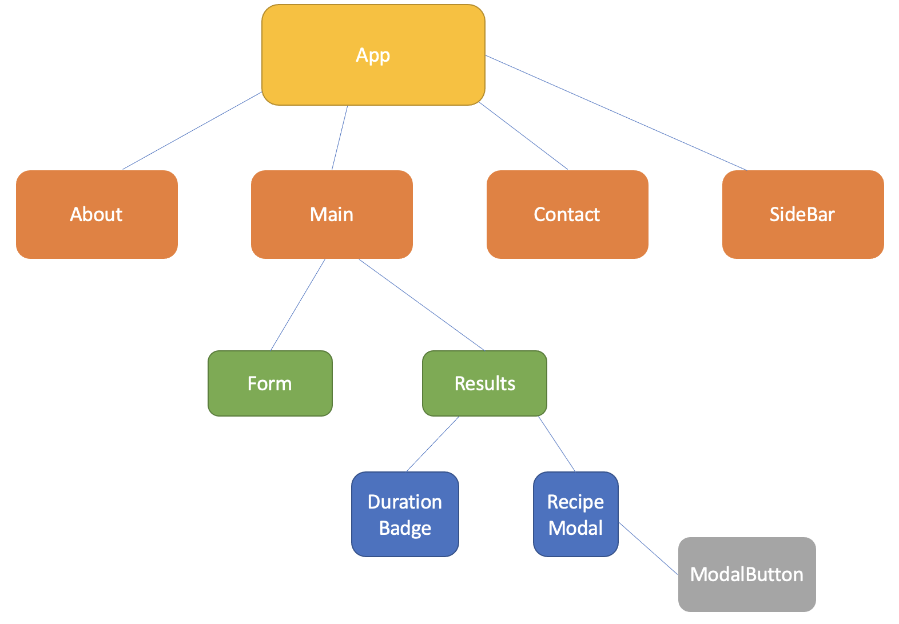
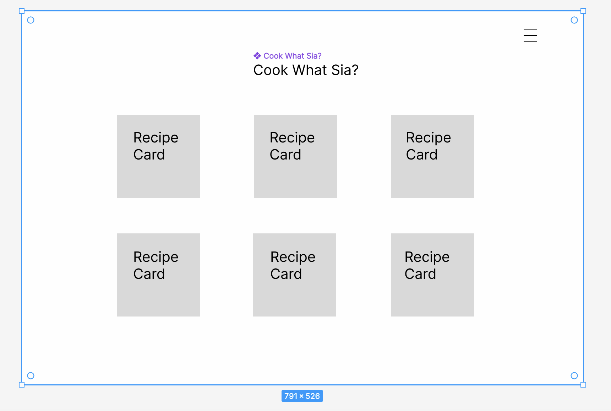

# Cook What Sia?

## Description

Have you ever had problems thinking about what to cook while looking at your fridge? I do.
Thus, I decided to create this project that can possibly help busy individuals to think of what dishes to 
have based on 3 ingredients they have at home.

### Technologies Used

- React
- Tailwind CSS 

### Wireframes

### User Stories

Users should be able to:
- Provide 3 different ingredients in the input boxes
- See a list of 10 potential recipes that could have at least 1 of the ingredients they provide
- Select the recipe that they are interested in, and click the button to view the recipe instructions
- Navigate the sidebar to see more details about the project, and input their details if they wish to contact the owners of the page

---

## Planning and Development Process

I wanted to use this project to apply what I have learnt for the past two weeks as much as possible, so I tried to implement most of the concepts. I thought about the hierarchy of components before going into coding. This helped me greatly as I was able to visualise how the data flow with positioning useStates at various components.

I spent some time finding an appropriate API before diving in. This is to ensure that I am able to retrieve all the information I need for the app. I started coding the components that I am more familiar with, then I proceed to think about fetching data from the APIs. 

I managed to complete the MVP 2 days before the presentation. Hence, I decided to spend time to learn a CSS alternative (Tailwind). It took some time to configure the settings, but it really is convenient to style the app using Tailwind. I really love it!

I also decided to practise a bit on routing, so I included a navbar and some links using React Router v6. 

### Problem-Solving Strategy

I spent some time to console logging the output datatype, so that I know which methods to call in order to get what I want.
I also observed how my instructor used "stringify" as another way to perceive JSON formatted objects.
Some time was spent on learning Tailwind as an alternative to overcome design issues. 

### Unsolved problems

- Ordered list with bullet points not being able to generate in the modal

## APIs Used

I used https://spoonacular.com/food-api in this project. Some of the other APIs do not really provide what I need.
From this site, I used 3 different links for different purposes:
1. To get a list of recipes based on the inputs of the user
2. To retrieve the instructions of each recipe
3. To include the duration of meal preparation for each recipe

---

## Acknowledgments

- My family, for their understanding and encouragement
- The instructional team, for giving their all in helping me to complete this project
- My course mates who have helped and supported me

---

 ## References

- Banner image source: https://i.pinimg.com/originals/33/ef/8b/33ef8b9c0b902154a6cd4103a21275ef.jpg
- About page image source: https://encrypted-tbn0.gstatic.com/images?q=tbn:ANd9GcRkieB3XvA6E8SR11A2zG9yflRUIQ4znO03ZA&usqp=CAU
- Body background image source: https://wallpaperaccess.com/full/5110845.jpg
